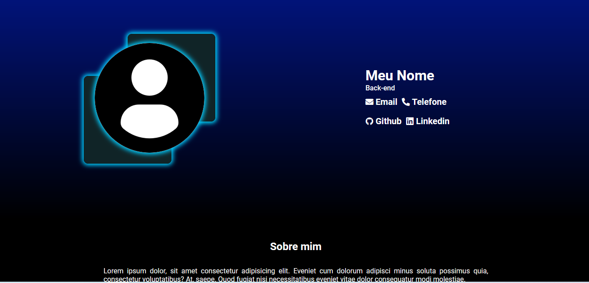
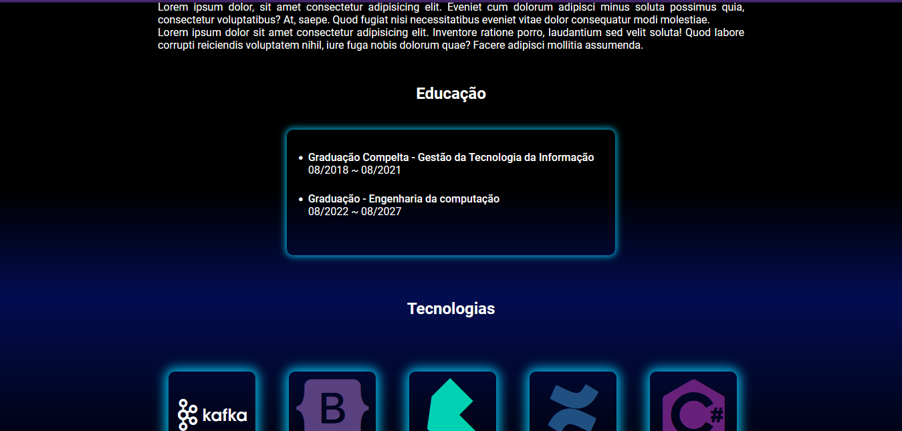
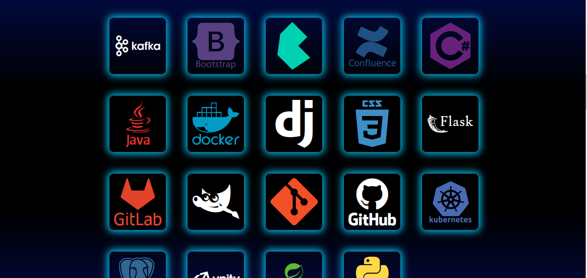
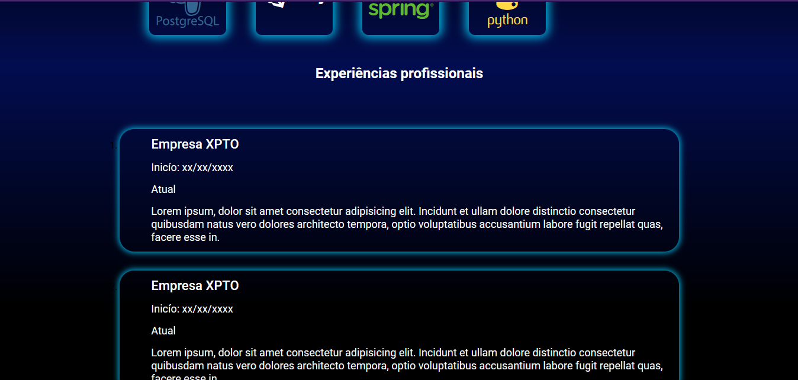
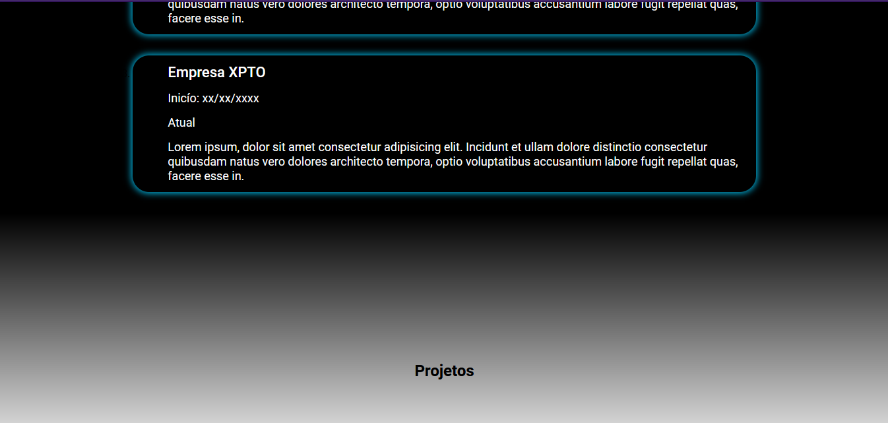
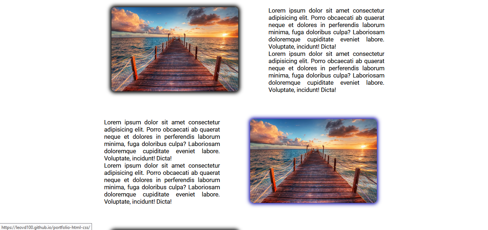
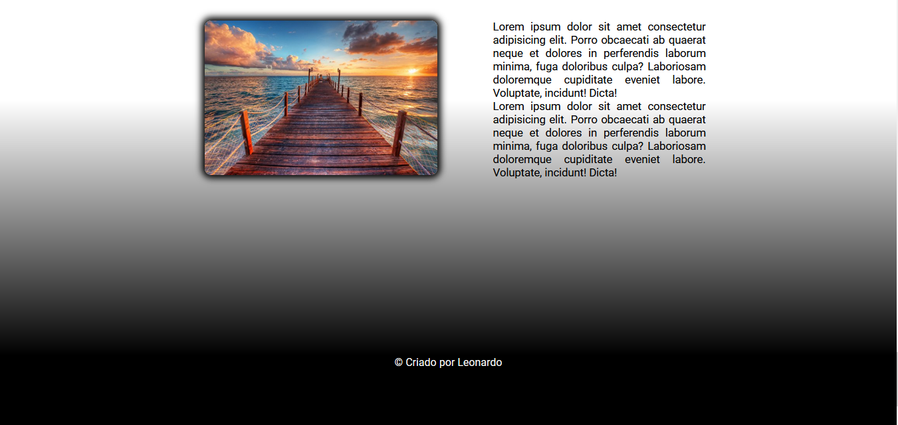
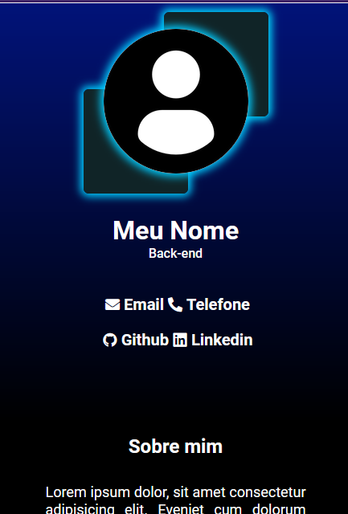
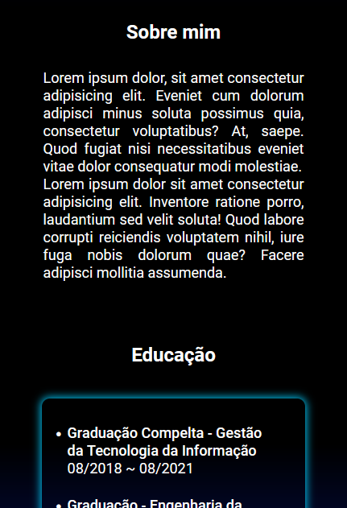
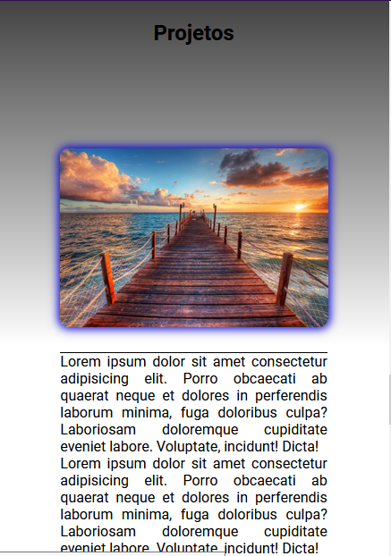

## Projeto Portfólio

---

Este projeto foi criado para a aula de criação de portfólio com HTML e CSS no canal CodeHelp no Youtube. 

O objetivo deste projeto é criar uma página de portfólio e disponibiliza-la no ar através do github pages. 

#### [link do portfólio criado](https://leovd100.github.io/portfolio-html-css/)

 
 
 
 
----

### Responsividade

